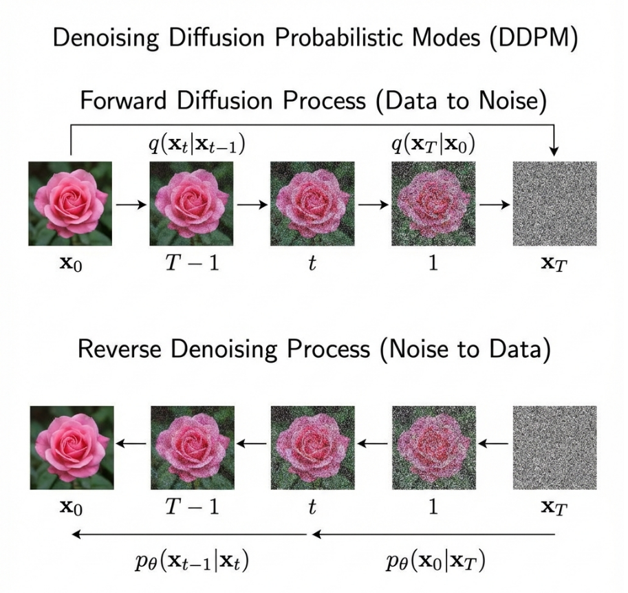
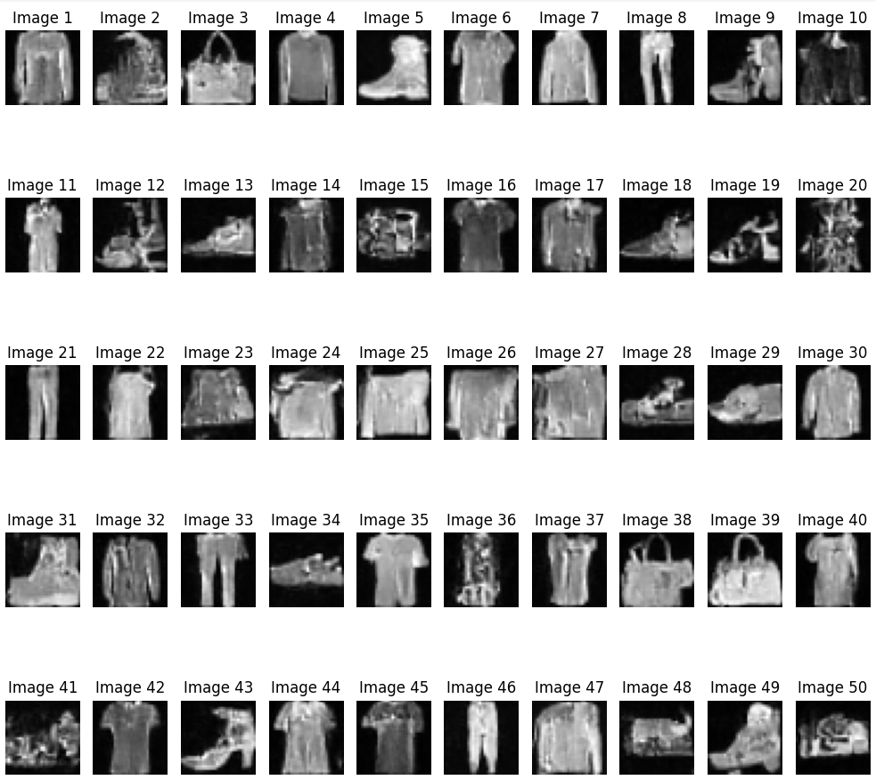
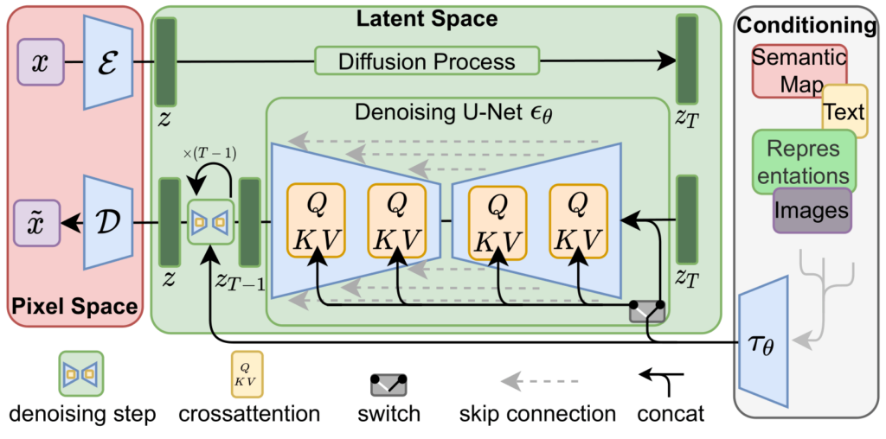
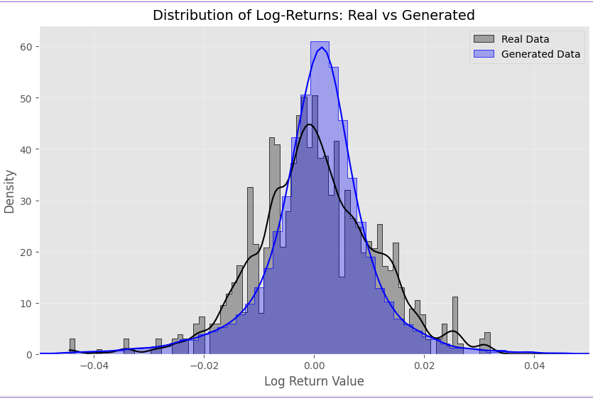

# Deep Generative Models - Diffusion, DreamBooth & Flow Matching

This repository contains implementations of three state-of-the-art generative modeling techniques. It explores pixel-space diffusion, parameter-efficient fine-tuning for latent diffusion models, and continuous-time flow matching for sequential financial data.

---

## 1. Denoising Diffusion Probabilistic & Implicit Models (DDPM & DDIM)

* Implemented DDPM and DDIM from scratch and train them on the FashionMNIST dataset.

### ⚙️ Methodology
* **Architecture:** Constructed a custom U-Net architecture integrated with time and context embeddings.
* **Forward Process:** Implemented a linear variance scheduler ($\beta_t$) to progressively add Gaussian noise to the images over 1000 timesteps.
* **Reverse Process:** Trained the network to predict and subtract noise, enabling reverse diffusion from pure noise to structured images.
* **Sampling:** Implemented two distinct algorithms: the standard Markovian DDPM and the accelerated non-Markovian DDIM.

  
  
<i>Figure 1: Forward and backward pass of diffusion models. </i>

### Results 
The model successfully learned to generate realistic FashionMNIST clothing items from pure Gaussian noise. By utilizing the DDIM sampler, inference steps were drastically reduced from **1000 steps** (DDPM) to just **20 steps** (DDIM) while preserving visual fidelity. 

  
  
<i>Figure 2: 50 FashionMNIST samples generated using the trained diffusion model (DDPM).</i>

* **Quantitative Evaluation (FID):** The structural quality and similarity of generated images to the real dataset were computed and compared using the Fréchet Inception Distance (FID) score, validating the effectiveness of the U-Net.

---

## 2. DreamBooth LoRA Fine-Tuning for Stable Diffusion

* We taught a pre-trained text-to-image model (Stable Diffusion v1.5) to generate images of a specific custom subject (a car) in novel environments.

### ⚙️ Methodology
* **Subject Binding:** Leveraged DreamBooth concepts to bind the custom car to a rare token identifier (`<sks>`).
* **Parameter Efficiency:** Utilized **LoRA (Low-Rank Adaptation)** to inject trainable rank decomposition matrices ($r=4$) into the UNet's cross-attention layers. This isolated the training to a tiny fraction of the parameters, making fine-tuning highly memory-efficient.
* **Prior Preservation:** Generated 100 generic "class images" (`"a photo of a car"`) and used a Prior Preservation Loss to prevent the model from overfitting on the specific subject and forgetting its general knowledge (language drift).

  
  
<i>Figure 3: ‫‪Stable Diffusion‬‬ ‫‪Architecture‬‬. </i>

### Results
The model successfully learned the custom subject and gained the ability to generate it in entirely new environments and artistic styles, successfully sidestepping catastrophic forgetting.

  
  
<i>Figure 4: The custom &lt;sks&gt; car generated in a novel environment ("&lt;sks&gt; car on the moon").</i>

---

## 3. Financial Time Series using Flow Matching

* Generated synthetic, realistic financial time series data that mimics the SPY ETF (S&P 500) using Conditional Flow Matching.

### ⚙️ Methodology
* **Data Processing:** Addressed the non-stationarity of raw stock prices by calculating normalized log returns for stable training.
* **Vector Field Approximation:** Trained a 1D Convolutional Neural Network to approximate the continuous vector field.
* **Flow Matching:** Mapped a simple noise distribution to the complex empirical distribution of market returns by creating a linear probability path: $x_t = (1 - t)x_0 + tx_1$, and minimizing the Mean Squared Error against the target theoretical velocity ($x_1 - x_0$).

### Results
The generated data perfectly captures the random-walk nature and volatility clustering of real market data.

  
  
<i>Figure 5: Comparison of real SPY ETF trajectories vs. synthetic sequences generated via Flow Matching.</i>

* **Distributional Geometry:** Evaluated using the **Sliced Wasserstein Distance (SWD)**, achieving an exceptionally low score of **`0.001159`**, proving the model mathematically aligns with the real market's geometric distribution.
* **Temporal Dependencies (Market Memory):**  **Real Mean ACF (Lag-1):** `0.0312` (weak momentum).
    * **Generated Mean ACF (Lag-1):** `-0.0615` (slight mean reversion).
    * **Autocorrelation MSE:** **`0.004474`**. This microscopic error confirms the overall magnitude of temporal correlations was correctly simulated without severe overfitting.
