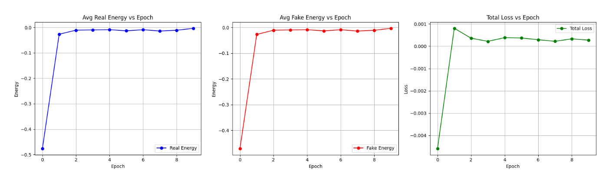
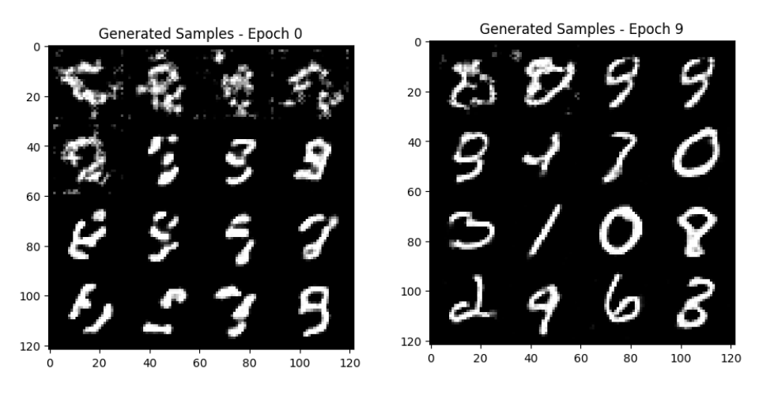
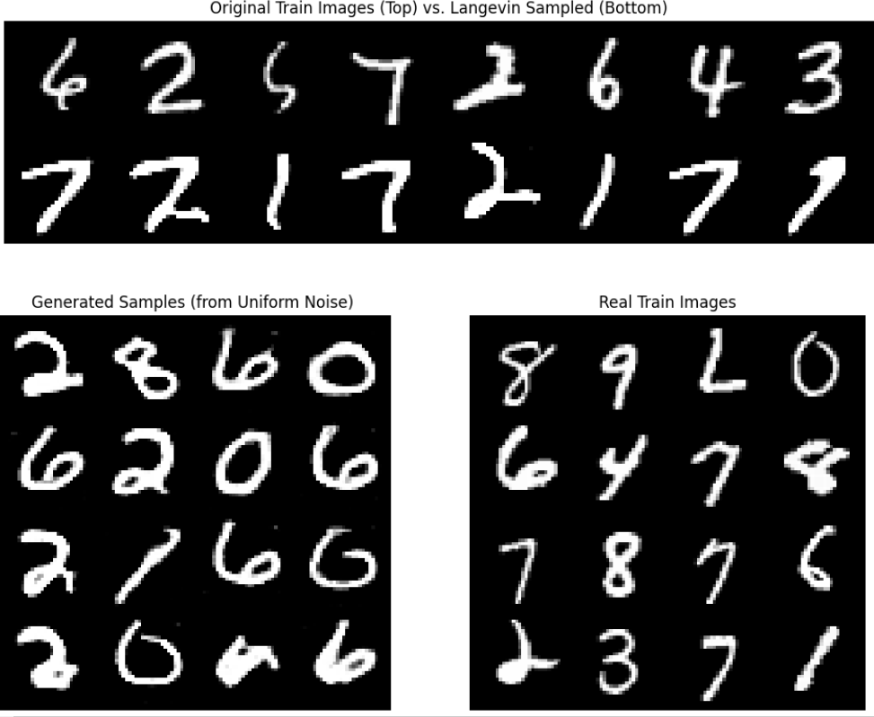
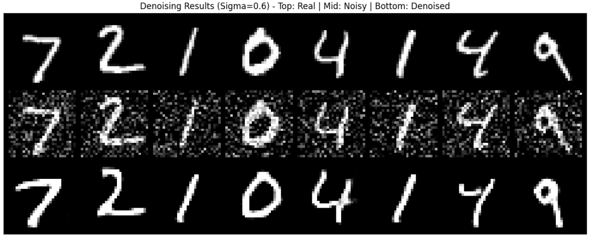
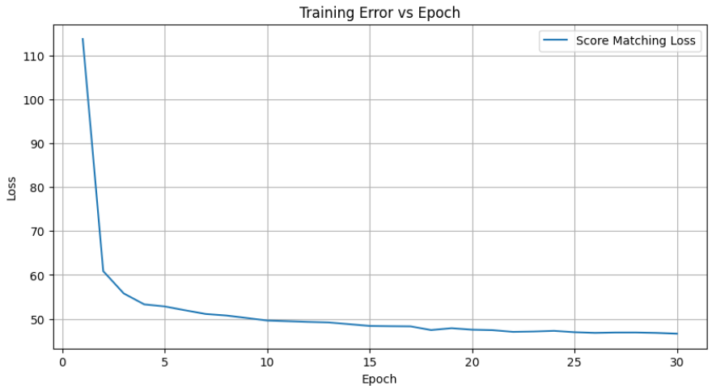
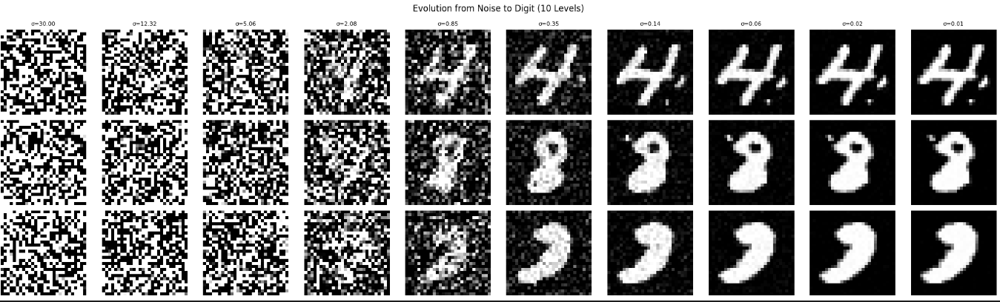
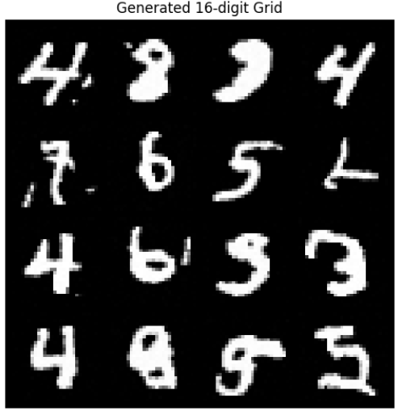
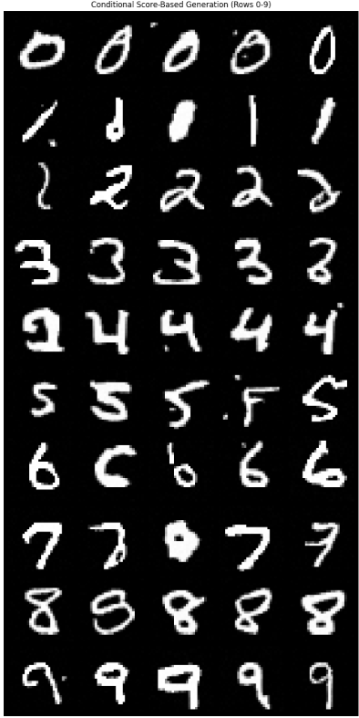

# Energy-Based & Score-Based Generative Models

## 📌 Overview

This repository explores two classes of implicit generative models that move beyond standard GANs and VAEs: **Energy-Based Models (EBMs)** and **Score-Based Generative Models (SGMs)**.

The project is divided into two distinct implementations:

1. **Energy-Based Models (EBM):** Learning an unnormalized probability density function  using Langevin Dynamics and a **Replay Buffer** for stable training.
2. **Score-Based Models (NCSN):** Learning the gradient of the log-density function  (the "score") using Denoising Score Matching and Annealed Langevin Dynamics.

## 📂 Project Structure

* `EBM-BestPractice.ipynb`: **(Primary EBM)** The optimized implementation using a **Replay Buffer** to stabilize training and prevent mode collapse.
* `score-based-model.ipynb`: Implementation of **NCSN (Noise Conditional Score Network)** for both unconditional and conditional generation.
* `EBM.ipynb`: A baseline EBM implementation (without replay buffer) for comparison.
* `Persion-Report.pdf`: Detailed technical report covering Contrastive Divergence, DSM, and noise scale analysis.

---

## ⚡ Part 1: Energy-Based Models (EBM)

### Methodology

We train a neural network  to assign low energy values to realistic data (MNIST) and high energy values to noise.

* **Training:** Uses **Contrastive Divergence** with Stochastic Gradient Langevin Dynamics (SGLD) to sample negative examples from the current model distribution.
* **Key Technique (Replay Buffer):** To improve sample quality and convergence speed, we maintain a buffer of past generated samples. These are used as initialization points for the MCMC chain, preventing the model from forgetting previously learned modes.

### Tasks

* **Generation:** Generating digits from pure noise via iterative energy minimization.
* **Denoising:** restoring clean images from noisy inputs by following the gradient of the energy function .

The loss diagram is presented below:

The model was trained for 10 epochs, we can see the model's generation progress below:

Inference:
1. starting from training data and applying langevin dynamics.
2. starting from pure unifoem noise and applying langevin dynamics.

3. denoising

---

## 🎼 Part 2: Score-Based Generative Models (SBM)

### Methodology

We implement a **Noise Conditional Score Network (NCSN)**. Instead of learning the density directly, we learn the *score function* (the direction to move towards high-density regions).

* **Score Matching:** Trained using **Denoising Score Matching (DSM)**, where the model learns to denoise samples perturbed by various levels of Gaussian noise ().
* **Sampling:** Uses **Annealed Langevin Dynamics**, starting with high noise levels (coarse structure) and gradually reducing noise (fine details).

### Conditional Generation

We extend the NCSN to perform **Class-Conditional Generation**  by injecting class labels into the score network, allowing us to control which digit is generated.

