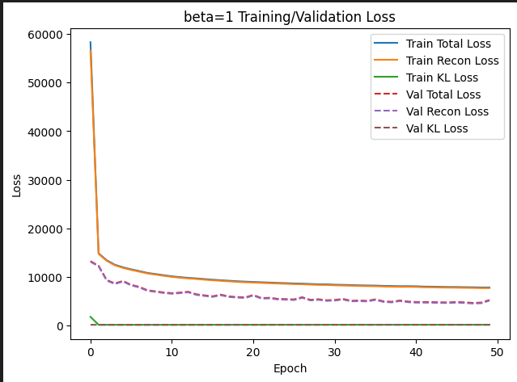
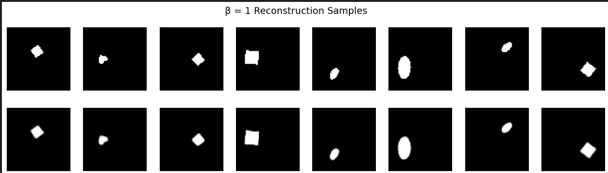

📌 Overview

This project implements **Variational Autoencoders (VAE)** and **$\beta$-VAEs** to explore the concept of **disentanglement** in deep generative models. Using the **dSprites** dataset, the project analyzes the trade-off between reconstruction quality and the independence of latent factors.

## 📂 Project Structure

* `VAE_Implementation.ipynb`: The core Jupyter Notebook containing the training pipeline, model architecture, and evaluation scripts.
* `Persion-Report.pdf`: A detailed report covering the theoretical background (PGM, VAE Evidence Lower Bound), experiment results, and analysis of VAE variants (VQ-VAE, VampPrior, SC-VAE).

## 🚀 Key Features

* **Custom Architecture**: A convolutional Encoder-Decoder network designed for  single-channel images.
* **$\beta$-VAE Implementation**: Support for adjustable  parameters () to control the regularization strength of the KL-divergence term.
* **Disentanglement Metrics**: Implementation of the **MIG (Mutual Information Gap)** score to quantify how well the latent variables map to the ground truth factors (Shape, Scale, Orientation, Position).
* **Latent Space Visualization**: Dimensionality reduction using PCA to visualize the structure of the learned latent space.

## 🛠️ Implementation Details

### Model Architecture

* **Encoder**: 3x Conv2D layers (filters: 32, 64, 128) with Batch Normalization, LeakyReLU, and Dropout. Outputs a probabilistic latent distribution .
* **Latent Space**: 16-dimensional vector sampled using the Reparameterization Trick.
* **Decoder**: Dense layer followed by 3x Conv2DTranspose layers to reconstruct the input.

### Dataset

The project utilizes the **dSprites** dataset, a standard benchmark for disentanglement consisting of 2D shapes generated from 6 independent latent factors:

* Color, Shape, Scale, Orientation, Position X, Position Y.

### Training Dynamics

### Model Reconstructions

